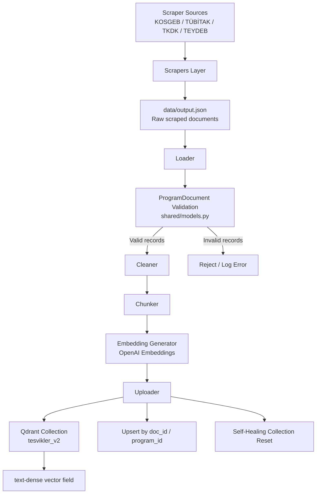

# Ingestion Service

## Veri Yükleme, Temizleme, Chunking, Embedding ve Qdrant’e Aktarım Servisi

**Ingestion Service**, KOBİ Teşvik & Destek Sistemi mimarisinde yer alan; teşvik, hibe ve destek programlarına ait ham dökümanları işleyen, temizleyen, anlamsal parçalara ayıran, vektörleştiren ve **Qdrant Vektör Veritabanı**’na yükleyen modüler bir **ETL (Extract, Transform, Load)** pipeline servisidir.

Bu servis; **KOSGEB, TÜBİTAK, TKDK, TEYDEB** gibi kaynaklardan **scraper servisleri** aracılığıyla toplanan içerikleri standart bir veri sözleşmesine dönüştürür, kalite kontrolünden geçirir ve **RAG (Retrieval-Augmented Generation)** katmanında kullanılabilecek hale getirir.

Sistemin temel amacı, dağınık ve farklı formatlardaki teşvik programı dökümanlarını tek bir standart yapıya oturtmak; arama, eşleştirme ve soru-cevap servislerinin güvenilir biçimde çalışabilmesi için **temiz, doğrulanmış ve vektörleştirilmiş veri üretmektir.**

---

# İçindekiler

* [Genel Bakış](#-genel-bakış)
* [Temel Sorumluluklar](#-temel-sorumluluklar)
* [Mimari Akış](#-mimari-akış)
* [Öne Çıkan Mühendislik Özellikleri](#-öne-çıkan-mühendislik-özellikleri)
* [Veri Yaşam Döngüsü](#-veri-yaşam-döngüsü)
* [Proje Yapısı](#-proje-yapısı)
* [Bileşenler ve Görevleri](#-bileşenler-ve-görevleri)
* [Veri Modeli ve Doğrulama](#-veri-modeli-ve-doğrulama)
* [Ortam Değişkenleri](#-ortam-değişkenleri)
* [Çalıştırma Talimatları](#-çalıştırma-talimatları)

  * [Docker Compose ile Çalıştırma](#1-docker-compose-ile-çalıştırma-önerilen)
  * [Yerel Geliştirme Ortamında Çalıştırma](#2-yerel-geliştirme-ortamında-çalıştırma)
* [CLI Kullanımı](#-cli-kullanımı)
* [Çıktı Formatı](#-çıktı-formatı)
* [Qdrant Yükleme Stratejisi](#-qdrant-yükleme-stratejisi)
* [Hata Yönetimi ve Dayanıklılık](#-hata-yönetimi-ve-dayanıklılık)
* [Yeni Site / Yeni Kaynak Ekleme](#-yeni-site--yeni-kaynak-ekleme)
* [Geliştirme Notları](#-geliştirme-notları)
* [Sistemdeki Yeri](#-sistemdeki-yeri)

---

# Genel Bakış

KOBİ Teşvik & Destek Sistemi birden fazla servisten oluşan bir mimari üzerine kuruludur. Bu mimaride **Ingestion Service**, veriyi dış dünyadan alıp sisteme kazandıran çekirdek katmanlardan biridir.

Servisin görevleri özetle şunlardır:

1. **Scraper’lardan gelen ham dökümanları okumak**
2. **Metni temizlemek ve normalize etmek**
3. **Dökümanları anlamsal chunk’lara ayırmak**
4. **Her chunk için embedding üretmek**
5. **Vektörleri ve metadata’yı Qdrant’e yüklemek**
6. **Tüm bu süreçten önce veri sözleşmesi doğrulaması yapmak**

Bu sayede aşağı akışta çalışan **RAG Service / Search Service / Recommendation Service** gibi bileşenler, güvenilir ve sorgulanabilir bir vektör verisi üzerinde çalışabilir.

---

# Temel Sorumluluklar

Ingestion Service aşağıdaki görevleri üstlenir:

* **Ham veri okuma**
  Scraper servislerinin ürettiği `output.json` dosyasındaki kayıtları okur.

* **Veri temizleme**
  HTML etiketleri, bozuk karakterler, gereksiz boşluklar, anlamsız tekrarlar gibi kirli verileri temizler.

* **Veri standardizasyonu**
  Her kaydı ortak bir veri modeli olan `ProgramDocument` şemasına dönüştürür.

* **Doğrulama (Validation)**
  Eksik, hatalı veya şemaya uymayan kayıtları ayıklar. Böylece veritabanına yalnızca geçerli kayıtlar yazılır.

* **Chunking (Parçalama)**
  Uzun dökümanları anlamsal olarak daha küçük parçalara ayırır. Bu parçalar, RAG sorgularında daha doğru geri getirme yapılmasını sağlar.

* **Embedding üretimi**
  Her chunk için OpenAI embedding modeli ile vektör oluşturur.

* **Vektör veritabanına yükleme**
  Oluşan embedding’leri ve ilişkili metadata’yı Qdrant’e upsert eder.

* **İndeks ve koleksiyon yönetimi**
  Qdrant koleksiyonunu otomatik olarak oluşturur, gerekirse eski şemayı temizleyerek yeniden başlatır.

---

# Mimari Akış

Aşağıdaki akış, Ingestion Service’in uçtan uca veri işleme sürecini özetler:

```text
Scrapers / output.json
        │
        ▼
[ Loader ]
Ham JSON kayıtlarını okur
        │
        ▼
[ Validation ]
ProgramDocument şemasına göre doğrulama
        │
        ▼
[ Cleaner ]
HTML / bozuk karakter / whitespace temizliği
        │
        ▼
[ Chunker ]
Dökümanı anlamsal parçalara ayırır
        │
        ▼
[ Embedder ]
OpenAI ile embedding üretir
        │
        ▼
[ Uploader ]
Qdrant koleksiyonuna vektör + metadata yazar
        │
        ▼
Qdrant Vector DB
```
## System Flow Diagram


---

# Öne Çıkan Mühendislik Özellikleri

## 1) Ortak Model Doğrulaması (Pydantic Validation)

Servise giren her kayıt, veritabanına yazılmadan önce **ortak veri sözleşmesine** göre doğrulanır. Bu sözleşme, `shared/models.py` içerisinde tanımlanan **`ProgramDocument`** modelidir.

Doğrulama kapsamında örneğin:

* `program_name` boş olmamalıdır
* `url` geçerli bir URL olmalıdır
* `source` tanımlı olmalıdır
* `sections` alanı beklenen yapıda olmalıdır

Bu yaklaşım sayesinde:

* hatalı kayıtlar erken aşamada elenir,
* RAG tarafında bozuk veri kaynaklı sorunlar azalır,
* tüm servisler aynı veri modeli üzerinde konuşur.

---

## 2) Self-Healing Reset (Kendi Kendini Onaran Koleksiyon Kurulumu)

Servis her çalıştırıldığında Qdrant tarafında ilgili koleksiyonun durumu kontrol edilir.
Eğer koleksiyon:

* bozuk şemaya sahipse,
* eski bir vektör alanı yapısı kullanıyorsa,
* güncel ingestion standardı ile uyumsuzsa,

servis koleksiyonu otomatik olarak silip yeniden oluşturabilir.

Bu sayede manuel veritabanı temizliği ihtiyacı azalır ve ortamlar arası tutarlılık korunur.

---

## 3) Upsert Mantığı ile Mükerrer Kayıt Önleme

Aynı teşvik programının birden fazla kez eklenmesini önlemek için kayıtlar **benzersiz bir doküman kimliği** ile yüklenir.

Örnek strateji:

* `doc_id = program_id`
* Qdrant’e `insert` yerine **`upsert`** yapılır

Bunun sonucu olarak:

* servis tekrar çalıştırıldığında veri kopyalanmaz,
* aynı program güncellendiyse eski kayıt üzerine yazılır,
* koleksiyon tutarlı kalır.

---

## 4) Vektör Alanı Standartlaştırma

RAG servisinin vektör aramalarını tutarlı şekilde yapabilmesi için embedding alanı Qdrant tarafında sabit bir isimle tutulur:

* **`text-dense`**

Bu alan adı tüm sistem boyunca sabitlenerek:

* sorgu servisinde karmaşayı azaltır,
* embedding pipeline’ını standartlaştırır,
* model/servis entegrasyonunu kolaylaştırır.

---

## 5) Modüler ETL Tasarımı

Servis tek parça büyük bir script yerine, sorumlulukları ayrılmış modüllerden oluşur:

* **loader** → veriyi okur
* **cleaner** → veriyi temizler
* **chunker** → veriyi parçalar
* **embedder** → vektör üretir
* **uploader** → veritabanına yazar

Bu tasarım sayesinde:

* bakım kolaylaşır,
* yeni kaynak eklemek basitleşir,
* her modül bağımsız test edilebilir,
* ileride model/vektör DB değişikliği daha az maliyetli olur.

---

# Veri Yaşam Döngüsü

Aşağıda tek bir teşvik kaydının sistem içindeki yaşam döngüsü özetlenmiştir:

## Aşama 1 — Veri Toplama

Scraper servisleri resmi kurum sitelerinden teşvik programı içeriklerini çeker ve bunları `data/output.json` içinde saklar.

## Aşama 2 — Ham Kayıtların Okunması

Loader katmanı `output.json` dosyasını açar ve her kaydı tek tek ingestion pipeline’ına aktarır.

## Aşama 3 — Şema Doğrulama

Her kayıt `ProgramDocument` modeline parse edilir. Şemaya uymayan kayıtlar reddedilir veya hata log’una alınır.

## Aşama 4 — Temizleme

Metin içeriği normalize edilir:

* HTML tag’leri temizlenir
* bozuk encoding karakterleri düzeltilir
* gereksiz satır sonları ve whitespace azaltılır
* metin alanları standardize edilir

## Aşama 5 — Chunking

Uzun program açıklamaları veya çok bölümlü dökümanlar daha küçük anlamsal parçalara bölünür. Her chunk, arama kalitesini artırmak için metadata ile ilişkilendirilir.

## Aşama 6 — Embedding

Her chunk için OpenAI embedding modeli ile vektör üretilir.

## Aşama 7 — Qdrant’e Yükleme

Embedding + metadata birlikte Qdrant’e yazılır. Bu metadata tipik olarak şunları içerebilir:

* program adı
* kaynak kurum
* orijinal URL
* bölüm başlığı
* chunk sırası
* scrape tarihi
* program kimliği / doküman kimliği

---

# Proje Yapısı

Aşağıda servis için önerilen modüler dizin yapısı yer almaktadır:

```text
ingestion_service/
├── chunkers/         # Dökümanları anlamsal parçalara ayırır
├── cleaners/         # HTML, bozuk karakter, whitespace temizliği yapar
├── data/             # Scraper tarafından üretilen output.json dosyaları
├── embeddings/       # OpenAI embedding ayarları ve embedder mantığı
├── loaders/          # JSON / dosya tabanlı veri okuyucular
├── scrapers/         # KOSGEB, TÜBİTAK vb. veri kazıyıcılar
├── uploader/         # Qdrant’e yükleme ve koleksiyon yönetimi
├── utils/            # HTTP client, yardımcı fonksiyonlar, ortak yardımcılar
├── main.py           # Pipeline orkestrasyonu
├── Dockerfile        # Konteyner yapılandırması
└── requirements.txt  # Python bağımlılıkları
```

---

# Bileşenler ve Görevleri

## `main.py`

Servisin ana giriş noktasıdır. Tüm ETL pipeline’ını sırayla çalıştırır:

1. Veri kaynağını yükler
2. Kayıtları doğrular
3. Temizler
4. Chunk’lara böler
5. Embedding üretir
6. Qdrant’e yükler

Ayrıca CLI parametrelerini de yönetir.

---

## `scrapers/`

KOSGEB, TÜBİTAK, TKDK, TEYDEB gibi kurum sitelerinden veri çeken modülleri içerir.

Her scraper tipik olarak iki ana sorumluluk taşır:

* `get_program_urls(session)` → ilgili sitedeki program URL’lerini toplar
* `parse_program(session, url)` → tekil program sayfasını parse eder ve kayıt döndürür

---

## `loaders/`

Yerel dosya sisteminden ham veriyi okuyan katmandır.
Örneğin `data/output.json` içindeki kayıtları Python nesnelerine dönüştürür.

Bu katman ileride:

* S3 / MinIO
* API response
* message queue
* farklı dosya formatları

gibi alternatif kaynaklara genişletilebilir.

---

## `cleaners/`

Ham içerik üzerinde veri temizliği yapan katmandır.

Örnek işlemler:

* HTML tag temizliği
* `&nbsp;`, `\xa0` gibi karakterlerin normalize edilmesi
* gereksiz satır sonlarının sadeleştirilmesi
* metnin okunabilir hale getirilmesi

Temizleme adımı embedding kalitesini doğrudan etkilediği için kritik öneme sahiptir.

---

## `chunkers/`

Uzun dökümanları anlamsal olarak daha küçük parçalara ayırır.

Chunking’in amacı:

* tek embedding’in aşırı uzun bir metni temsil etmesini önlemek
* arama sırasında daha isabetli geri getirme sağlamak
* bölüm bazlı retrieval yapılmasını kolaylaştırmak

Chunk metadata’sında tipik olarak şu alanlar bulunabilir:

* `doc_id`
* `program_name`
* `section_title`
* `chunk_index`
* `source`
* `url`

---

## `embeddings/`

OpenAI embedding modeli ile vektör üretimini yöneten katmandır.

Bu katman:

* model seçimi
* API istemcisi kurulumu
* batch embedding stratejisi
* rate limit / retry yönetimi

gibi sorumlulukları taşıyabilir.

---

## `uploader/`

Oluşan embedding’leri ve metadata’yı Qdrant’e yazan katmandır.

Başlıca sorumlulukları:

* koleksiyon var mı kontrol etmek
* yoksa oluşturmak
* gerekiyorsa sıfırlamak
* point payload’larını hazırlamak
* `upsert` işlemini yürütmek

---

## `utils/`

Servis genelinde ortak kullanılan yardımcı bileşenleri içerir.

Örnekler:

* HTTP session / retry mantığı
* URL normalize etme
* tarih parse etme
* hash / id üretme
* logging yardımcıları

---

# 📑 Veri Modeli ve Doğrulama

Servis, veritabanına yazmadan önce her dökümanı ortak bir sözleşmeye göre doğrular.
Bu sözleşme `shared/models.py` içinde tanımlı **`ProgramDocument`** modelidir.

Örnek bir doküman yapısı:

```json
{
  "url": "https://...",
  "source": "kosgeb",
  "scraped_at": "2026-06-12T10:30:00+00:00",
  "program_name": "Girişim Sermayesi Yatırım Fonları Yatırımları",
  "sections": [
    {
      "title": "Programın Amacı",
      "content": "..."
    },
    {
      "title": "Başvuru Formları",
      "content": "...",
      "links": [
        { "text": "Başvuru Formu", "href": "https://..." }
      ]
    }
  ]
}
```

## Beklenen Alanlar

| Alan           | Açıklama                                                  |
| -------------- | --------------------------------------------------------- |
| `url`          | Programın resmi kaynak URL’si                             |
| `source`       | Kaynağın kısa adı (`kosgeb`, `tubitak`, `tkdk`, `teydeb`) |
| `scraped_at`   | Verinin çekildiği zaman damgası                           |
| `program_name` | Programın adı                                             |
| `sections`     | Program içeriğinin başlık-bazlı bölümlere ayrılmış hali   |

## Hatalı Kayıtlar

Eğer bir kayıt başarıyla parse edilemiyorsa veya scraping sırasında hata oluşuyorsa kayıt tamamen silinmez. Bunun yerine `"error"` alanı ile saklanabilir. Böylece:

* başarısız kayıtlar sonradan incelenebilir,
* scraper iyileştirmesi sonrası tekrar çekilebilir,
* veri kaybı önlenir.

Örnek hata kaydı:

```json
{
  "url": "https://...",
  "source": "kosgeb",
  "error": "Timeout while parsing program detail page"
}
```

---

# Ortam Değişkenleri

Servisin çalışabilmesi için proje kök dizinindeki `.env` dosyasında aşağıdaki değişkenlerin tanımlı olması gerekir:

```env
OPENAI_API_KEY=sk-proj-YourActualOpenAIKeyHere
QDRANT_URL=http://qdrant:6333
```

İhtiyaca göre aşağıdaki gibi ek değişkenler de tanımlanabilir:

```env
QDRANT_COLLECTION=tesvikler_v2
OPENAI_EMBEDDING_MODEL=text-embedding-3-large
LOG_LEVEL=INFO
```

> Not: Gerçek API anahtarları kesinlikle GitHub’a commit edilmemelidir.

---

# Çalıştırma Talimatları

# 1. Docker Compose ile Çalıştırma (Önerilen)

Ingestion Service, docker-compose mimarisinde kontrollü çalıştırılacak şekilde **`setup` profile** altında tanımlanmıştır. Bu nedenle `docker compose up` komutuyla otomatik başlamaz.

## İmajı yeniden build etmek

```bash
docker compose --profile setup build --no-cache ingestion_service
```

## Veri yükleme sürecini başlatmak

```bash
docker compose run ingestion_service
```

Bu komut çalıştığında servis tipik olarak şu akışı izler:

1. `output.json` dosyasını okur
2. kayıtları doğrular
3. temizler
4. chunk’lara böler
5. embedding üretir
6. Qdrant koleksiyonuna yükler

---

# 2. Yerel Geliştirme Ortamında Çalıştırma

Yerel makinede test etmek için önce sanal ortamınızı aktive edin ve bağımlılıkları kurun:

```bash
pip install -r requirements.txt
```

Ardından servisi çalıştırın:

```bash
python main.py
```

---

# CLI Kullanımı

Servis hem tam veri yükleme hem de scraper odaklı kullanım için CLI parametreleri destekleyebilir.

## Tüm siteleri çalıştır

```bash
python main.py
```

## Tek siteyi çalıştır

```bash
python main.py --sites kosgeb
```

## Birden fazla siteyi çalıştır

```bash
python main.py --sites kosgeb tubitak
```

## Sadece URL’leri listele / sayfa çekmeden dene

```bash
python main.py --dry-run
```

## Mevcut `output.json` dosyasını yok sayarak baştan başla

```bash
python main.py --no-resume
```

> Not: Bu CLI kullanım şekli scraper + ingestion akışını tek bir entrypoint altında birleştiren yapılarda oldukça kullanışlıdır. Eğer scraper ve ingestion ayrı servislerse, bu komutlar proje mimarisine göre ayrıştırılabilir.

---

# Çıktı Formatı

Scraper katmanının ürettiği ham çıktı dosyası:

```text
data/output.json
```

Her kayıt aşağıdaki yapıya benzer şekilde tutulur:

```json
{
  "url": "https://...",
  "source": "kosgeb",
  "scraped_at": "2026-06-12T10:30:00+00:00",
  "program_name": "Girişim Sermayesi Yatırım Fonları Yatırımları",
  "sections": [
    {
      "title": "Programın Amacı",
      "content": "..."
    },
    {
      "title": "Başvuru Formları",
      "content": "...",
      "links": [
        { "text": "Başvuru Formu", "href": "https://..." }
      ]
    }
  ]
}
```

---

# Qdrant Yükleme Stratejisi

Servis, Qdrant üzerinde tipik olarak aşağıdaki prensiplerle çalışır:

## Koleksiyon adı

Örnek koleksiyon adı:

```text
tesvikler_v2
```

## Vektör alanı adı

Embedding vektörleri sabit bir alan adına yazılır:

```text
text-dense
```

## Upsert mantığı

Aynı dökümanın tekrar yazılması durumunda veri çoğalmasını önlemek için `upsert` kullanılır.

Örnek mantık:

* `doc_id = program_id`
* her chunk için deterministik bir `point_id` üret
* aynı kayıt gelirse güncelle

## Metadata / Payload alanları

Her chunk için Qdrant payload’ında şu bilgiler tutulabilir:

* `doc_id`
* `program_id`
* `program_name`
* `source`
* `url`
* `section_title`
* `chunk_index`
* `scraped_at`
* `text`

Bu yapı, daha sonra:

* kaynak gösterme,
* filtreli arama,
* kuruma göre listeleme,
* program bazlı gruplayarak cevap üretme

gibi işlemleri kolaylaştırır.

---

# Hata Yönetimi ve Dayanıklılık

Ingestion pipeline’ı gerçek dünyadaki veri düzensizliklerine karşı dayanıklı olacak şekilde tasarlanmıştır.

## Uygulanan stratejiler

### 1. Hatalı kayıtları silmemek

Scraping veya parsing sırasında hata oluşan kayıtlar `"error"` alanıyla saklanır. Böylece hata analizi yapılabilir.

### 2. Validation ile erken hata yakalama

Şemaya uymayan kayıtlar veritabanına gitmeden engellenir.

### 3. Retry / timeout yaklaşımı

HTTP istekleri ve dış servis çağrıları için tekrar deneme (retry) ve timeout stratejileri uygulanabilir.

### 4. Idempotent yükleme

Aynı pipeline’ın tekrar çalıştırılması veri bütünlüğünü bozmaz; mevcut kayıtlar güncellenir.

### 5. Koleksiyon reset desteği

Şema değişimlerinde veritabanı tarafında manuel temizlik zorunluluğu azaltılır.

---

# Yeni Site / Yeni Kaynak Ekleme

Yeni bir kurum veya teşvik kaynağı eklemek için aşağıdaki adımlar izlenir.

## 1) Yeni scraper modülü oluşturun

Örnek:

```text
scrapers/yeni_site.py
```

## 2) Gerekli fonksiyonları implement edin

Her scraper en az şu iki fonksiyonu sağlamalıdır:

```python
def get_program_urls(session):
    ...
```

```python
def parse_program(session, url):
    ...
```

### `get_program_urls(session)`

* kurumun listeleme sayfalarını gezer
* program detay URL’lerini toplar
* benzersiz URL listesi döndürür

### `parse_program(session, url)`

* tek bir program sayfasını parse eder
* standart kayıt formatında veri döndürür
* mümkünse `program_name`, `sections`, `links`, `source`, `scraped_at` alanlarını üretir

---

## 3) Scraper’ı orchestrator’a kaydedin

`main.py` içindeki `SCRAPERS` sözlüğüne ekleyin:

```python
SCRAPERS = {
    "kosgeb":  kosgeb,
    "tubitak": tubitak,
    "tkdk":    tkdk,
    "teydeb":  teydeb,
    "yeni":    yeni_site,
}
```

---

## 4) Çıktının veri sözleşmesine uyduğundan emin olun

Yeni scraper’ın ürettiği kayıtlar `ProgramDocument` ile uyumlu olmalıdır.
Özellikle şu alanları dikkatle üretin:

* `url`
* `source`
* `scraped_at`
* `program_name`
* `sections`

---

# Geliştirme Notları

## Önerilen geliştirme iyileştirmeleri

Aşağıdaki başlıklar servis için doğal sonraki adımlar olabilir:

### Batch embedding

Embedding çağrılarını tek tek yapmak yerine batch mantığıyla çalıştırmak maliyet ve hız açısından avantaj sağlayabilir.

### Incremental ingestion

Tüm koleksiyonu sıfırlamak yerine sadece değişen programları güncelleyen akıllı bir fark alma mekanizması eklenebilir.

### Scheduler / cron entegrasyonu

Servis günlük / haftalık olarak otomatik tetiklenecek şekilde planlanabilir.

### Dead-letter / failed records klasörü

Kalıcı hata veren kayıtları ayrı bir hata kuyruğuna veya JSON dosyasına almak debugging’i kolaylaştırabilir.

### Observability

Aşağıdaki izleme yetenekleri eklenebilir:

* structured logging
* ingestion metrikleri
* kaç kayıt parse edildi / elendi / yüklendi bilgisi
* embedding süresi / Qdrant yükleme süresi

### Unit ve integration testler

Özellikle şu bileşenler için test önerilir:

* scraper parse fonksiyonları
* cleaner kuralları
* chunker davranışı
* Qdrant uploader
* ProgramDocument validation

---

# Sistemdeki Yeri

Bu servis, genel KOBİ Teşvik & Destek Sistemi mimarisinde aşağıdaki rolü üstlenir:

* **Scraper Service** → veriyi toplar
* **Ingestion Service** → veriyi işler, doğrular, vektörleştirir ve yükler
* **RAG / Search Service** → Qdrant üzerindeki vektörlerden arama ve cevap üretir
* **API / UI Katmanı** → son kullanıcıya öneri, eşleşme ve soru-cevap deneyimi sunar

Kısacası **Ingestion Service**, ham içeriği “arama ve yapay zeka kullanımına hazır bilgiye” dönüştüren çekirdek veri işleme katmanıdır.

---

# Özet

Ingestion Service şu problemleri çözer:

* farklı kaynaklardan gelen teşvik verilerini tek biçime indirger
* bozuk / eksik veriyi eler
* uzun dökümanları RAG’e uygun şekilde parçalar
* embedding üretir
* Qdrant’e güvenli ve tekrar çalıştırılabilir şekilde yükler

Sonuç olarak sistemin geri kalan bileşenleri, **temiz, doğrulanmış, indekslenmiş ve sorgulanabilir bir bilgi tabanı** üzerinde çalışır.


# Lisans

* Bu proje KOBİ Teşvik & Destek Sistemi kapsamında geliştirilmiştir.

* Tüm hakları ilgili proje ekibine aittir.

```
```
